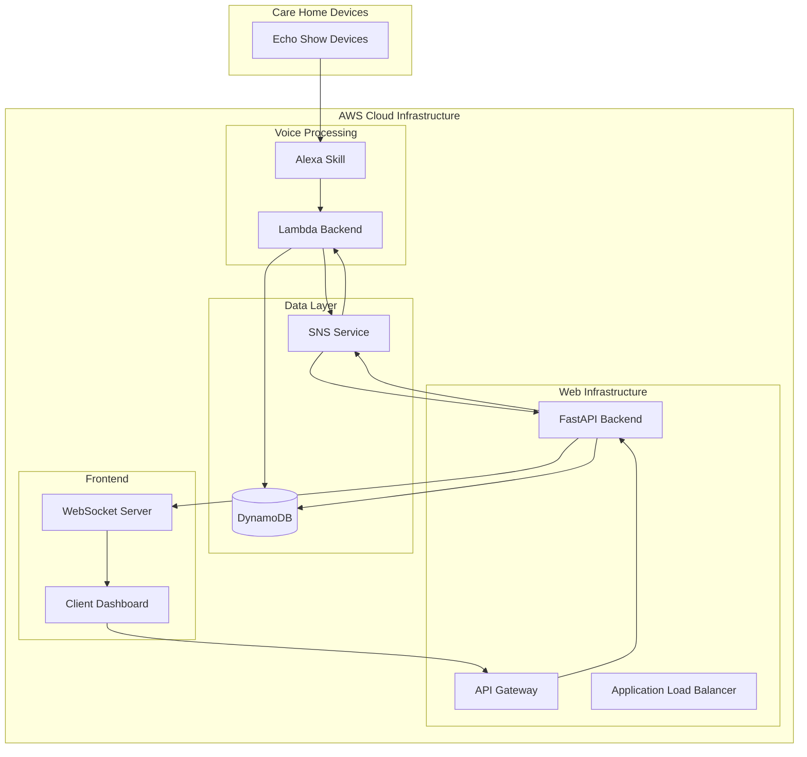

# Design Document: Alexa Plus Chatbot Expansion

## Overview

This design expands the existing Alexa Plus Chatbot from a basic Alexa skill to a comprehensive care home management system. The expansion integrates a FastAPI backend with the existing Lambda infrastructure, adds a real-time web dashboard for caregivers, implements comprehensive testing, and provides production-ready deployment capabilities.

The system maintains full backward compatibility with existing Alexa functionality while adding modern web-based management capabilities. The architecture follows microservices principles with clear separation of concerns between voice interface, web API, and dashboard components.

## Architecture

### High-Level Architecture



### Component Integration Strategy

The design ensures seamless integration between existing and new components:

1. **Shared Data Layer**: Both Lambda and FastAPI backends access the same DynamoDB tables
2. **Event Synchronization**: SNS topics distribute events to both systems for real-time updates
3. **API Compatibility**: FastAPI endpoints complement rather than replace Lambda functions
4. **Authentication Bridge**: Unified authentication system across web and voice interfaces
## Components and Interfaces

### FastAPI Backend Service

**Core Responsibilities:**
- REST API endpoints for web dashboard operations
- Real-time WebSocket server for live updates
- Integration with existing DynamoDB and SNS infrastructure
- Authentication and authorization for web access
- Data aggregation and reporting services

**Key Interfaces:**
```python
# REST API Endpoints
GET /api/v1/calls/recent          # Recent call activity
GET /api/v1/residents             # Resident management
POST /api/v1/residents            # Add new resident
PUT /api/v1/residents/{id}        # Update resident info
GET /api/v1/system/status         # System health check
GET /api/v1/analytics/dashboard   # Dashboard metrics

# WebSocket Endpoints
WS /ws/live-updates              # Real-time event stream
WS /ws/call-status               # Live call monitoring
```

**Integration Points:**
- DynamoDB: Shared table access with Lambda backend
- SNS: Subscribe to existing topics, publish web-specific events
- API Gateway: HTTP request routing and authentication
- CloudWatch: Logging and monitoring integration

### Client Dashboard Application

**Core Responsibilities:**
- Real-time monitoring of call activity and system status
- Resident profile management and configuration
- Historical data visualization and reporting
- Administrative controls and system configuration
- Responsive design for desktop and mobile access

**Key Features:**
- Live call status display with real-time updates
- Interactive resident directory with profile management
- Call history with filtering and search capabilities
- System health monitoring with alert notifications
- Administrative dashboard for system configuration

**Technology Stack:**
- Frontend Framework: React with TypeScript
- Real-time Communication: WebSocket client with reconnection logic
- UI Components: Modern component library (Material-UI or similar)
- State Management: React Context or Redux for complex state
- Charts and Visualization: Chart.js or D3.js for analytics

### Integration Layer

**Data Synchronization:**
The integration layer ensures data consistency between Lambda and FastAPI backends through:

1. **Shared DynamoDB Access Pattern:**
   - Both systems use identical table schemas
   - Consistent read/write patterns with proper error handling
   - Optimistic locking for concurrent updates

2. **Event-Driven Synchronization:**
   - SNS topics broadcast events to all interested services
   - Event sourcing pattern for audit trail and consistency
   - Dead letter queues for failed event processing

3. **API Coordination:**
   - FastAPI endpoints complement Lambda functions
   - No duplicate functionality between systems
   - Clear ownership boundaries for different operations
## Data Models

### Enhanced Data Schema

Building on the existing DynamoDB structure, the expanded system uses these core data models:

**Call Event Model:**
```python
class CallEvent:
    event_id: str           # Unique identifier
    timestamp: datetime     # Event occurrence time
    resident_id: str        # Associated resident
    event_type: str         # "touch_call", "emergency", "nurse_comm"
    status: str            # "active", "acknowledged", "resolved"
    caregiver_id: str      # Responding caregiver (optional)
    response_time: int     # Time to acknowledgment (seconds)
    metadata: dict         # Additional event-specific data
```

**Resident Profile Model:**
```python
class ResidentProfile:
    resident_id: str       # Unique identifier
    name: str             # Full name
    room_number: str      # Room assignment
    device_id: str        # Associated Echo Show device
    care_level: str       # Care requirements level
    emergency_contacts: list  # Contact information
    preferences: dict     # Communication preferences
    active: bool          # Current residency status
    created_at: datetime  # Profile creation time
    updated_at: datetime  # Last modification time
```

**System Status Model:**
```python
class SystemStatus:
    timestamp: datetime   # Status check time
    component: str       # "alexa_skill", "lambda", "fastapi", "dashboard"
    status: str         # "healthy", "degraded", "down"
    metrics: dict       # Performance metrics
    alerts: list        # Active alerts or issues
```

**Dashboard Session Model:**
```python
class DashboardSession:
    session_id: str      # Unique session identifier
    caregiver_id: str    # Authenticated user
    start_time: datetime # Session start
    last_activity: datetime  # Last interaction
    permissions: list    # Access permissions
    websocket_id: str    # Associated WebSocket connection
```

### Data Access Patterns

**Read Patterns:**
- Recent calls by time range (dashboard real-time view)
- Resident profile lookup by ID or room number
- System status aggregation across components
- Historical analytics with time-based partitioning

**Write Patterns:**
- Event logging with automatic timestamping
- Resident profile updates with audit trail
- System metrics collection with batch processing
- Real-time status updates via WebSocket broadcasts
## Correctness Properties

*A property is a characteristic or behavior that should hold true across all valid executions of a system—essentially, a formal statement about what the system should do. Properties serve as the bridge between human-readable specifications and machine-verifiable correctness guarantees.*

### Property 1: API Endpoint Completeness
*For any* core system operation, the FastAPI backend should provide a corresponding REST API endpoint that responds appropriately to valid requests.
**Validates: Requirements 1.1**

### Property 2: Authentication and Authorization Consistency
*For any* API request to the FastAPI backend, the system should properly authenticate the request and authorize access based on the user's permissions and the requested resource.
**Validates: Requirements 1.2, 4.4**

### Property 3: Cross-System Data Consistency
*For any* data modification operation, whether performed through the FastAPI backend or Lambda backend, both systems should observe the same data state when querying the DynamoDB store.
**Validates: Requirements 1.3, 1.5, 7.3**

### Property 4: SNS Integration Reliability
*For any* event that should trigger notifications, the FastAPI backend should successfully publish to SNS topics and receive notifications from SNS subscriptions without message loss.
**Validates: Requirements 1.4**

### Property 5: Real-time Dashboard Synchronization
*For any* call event or system state change, the client dashboard should reflect the updated information within acceptable time limits (under 2 seconds) when connected via WebSocket.
**Validates: Requirements 2.1, 2.3**

### Property 6: Dashboard Interface Completeness
*For any* required dashboard functionality (call logs, resident information, system status), the client dashboard should provide accessible and functional interfaces for caregivers.
**Validates: Requirements 2.2**

### Property 7: Administrative Action Logging
*For any* administrative action performed through the client dashboard, the system should create corresponding audit log entries with complete action details and timestamps.
**Validates: Requirements 2.4, 2.5**

### Property 8: Alexa Functionality Preservation
*For any* existing Alexa skill functionality, the expanded system should maintain identical behavior and response patterns as the original implementation.
**Validates: Requirements 7.1, 7.2, 7.5**

### Property 9: System Health and Recovery
*For any* system component failure or degradation, the health check mechanisms should detect the issue and automated recovery processes should attempt restoration within defined time limits.
**Validates: Requirements 4.5**
## Error Handling

### Error Classification and Response Strategy

**API Error Handling:**
- **4xx Client Errors**: Invalid requests, authentication failures, authorization denials
  - Return structured error responses with clear messages and error codes
  - Log security-related errors for monitoring and alerting
  - Implement rate limiting to prevent abuse

- **5xx Server Errors**: Internal system failures, database connectivity issues, external service failures
  - Return generic error messages to clients (avoid exposing internal details)
  - Log detailed error information for debugging and monitoring
  - Implement circuit breaker patterns for external service calls

**Real-time Communication Error Handling:**
- **WebSocket Connection Failures**: Network interruptions, server restarts, client disconnections
  - Implement automatic reconnection with exponential backoff
  - Maintain connection state and resume from last known position
  - Provide fallback polling mechanism when WebSocket unavailable

- **Event Processing Failures**: SNS message processing errors, DynamoDB write failures
  - Implement dead letter queues for failed message processing
  - Use retry mechanisms with exponential backoff for transient failures
  - Alert administrators for persistent failures requiring intervention

**Data Consistency Error Handling:**
- **Concurrent Modification Conflicts**: Multiple systems updating same data simultaneously
  - Use optimistic locking with version numbers or timestamps
  - Implement conflict resolution strategies (last-write-wins or merge strategies)
  - Provide clear error messages for conflicts requiring manual resolution

- **Cross-System Synchronization Failures**: FastAPI and Lambda backend data inconsistencies
  - Implement eventual consistency patterns with reconciliation processes
  - Use event sourcing for audit trail and conflict resolution
  - Provide administrative tools for manual data reconciliation

### Graceful Degradation Strategies

**Partial System Failures:**
- Dashboard continues to function with cached data when backend is unavailable
- Alexa skill maintains core functionality even if web components are down
- Read-only mode for dashboard when write operations are failing
- Fallback to basic functionality when advanced features are unavailable

**Recovery Procedures:**
- Automated health checks with self-healing capabilities
- Manual recovery procedures documented for complex failures
- Data backup and restore procedures for catastrophic failures
- Rollback procedures for failed deployments or updates
## Testing Strategy

### Dual Testing Approach

The testing strategy employs both unit testing and property-based testing to ensure comprehensive coverage and system reliability.

**Unit Testing Focus:**
- Specific API endpoint behavior and error conditions
- Individual component functionality and edge cases
- Integration points between system components
- Authentication and authorization logic
- Data model validation and serialization

**Property-Based Testing Focus:**
- Universal properties that hold across all system inputs
- Cross-system data consistency validation
- Real-time synchronization behavior
- System reliability under various load conditions
- Security properties across different user scenarios

### Testing Framework Configuration

**Backend Testing (FastAPI):**
- **Framework**: pytest with pytest-asyncio for async testing
- **Property Testing Library**: Hypothesis for Python property-based testing
- **Test Configuration**: Minimum 100 iterations per property test
- **Integration Testing**: TestClient for FastAPI endpoint testing
- **Database Testing**: In-memory DynamoDB for isolated testing

**Frontend Testing (React Dashboard):**
- **Framework**: Jest with React Testing Library
- **Property Testing**: fast-check for JavaScript property-based testing
- **WebSocket Testing**: Mock WebSocket server for real-time feature testing
- **End-to-End Testing**: Playwright or Cypress for full workflow testing

**Cross-System Integration Testing:**
- **Environment**: Docker Compose for multi-service testing
- **Data Consistency**: Property tests validating data synchronization
- **Event Flow**: End-to-end tests covering Alexa → Lambda → FastAPI → Dashboard flows
- **Performance Testing**: Load testing with realistic care home usage patterns

### Property Test Implementation Requirements

Each correctness property must be implemented as a property-based test with the following configuration:

- **Minimum 100 iterations** per property test to ensure statistical confidence
- **Test tagging** with format: **Feature: alexa-plus-chatbot-expansion, Property {number}: {property_text}**
- **Failure reporting** with clear indication of which property failed and why
- **Test data generation** appropriate for care home scenarios (realistic resident data, call patterns, etc.)

### Test Coverage Requirements

**API Coverage:**
- All REST endpoints with various input combinations
- Authentication and authorization scenarios
- Error conditions and edge cases
- Performance under expected load

**Integration Coverage:**
- Alexa skill → Lambda backend → DynamoDB flows
- FastAPI backend → DynamoDB → SNS flows
- WebSocket real-time updates end-to-end
- Cross-system data consistency scenarios

**Security Coverage:**
- Authentication bypass attempts
- Authorization escalation scenarios
- Input validation and sanitization
- Data encryption and secure transmission

The testing strategy ensures that both concrete examples (unit tests) and universal behaviors (property tests) are validated, providing confidence in system correctness and reliability for care home operations.